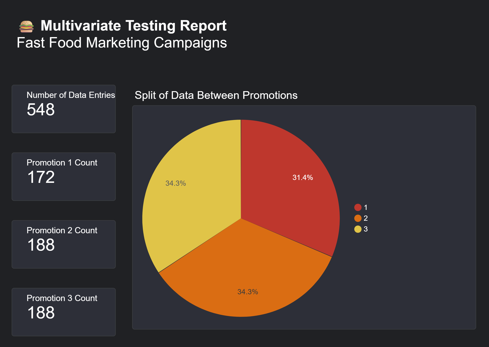
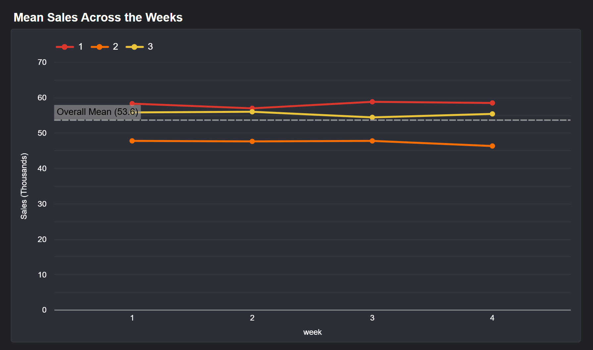
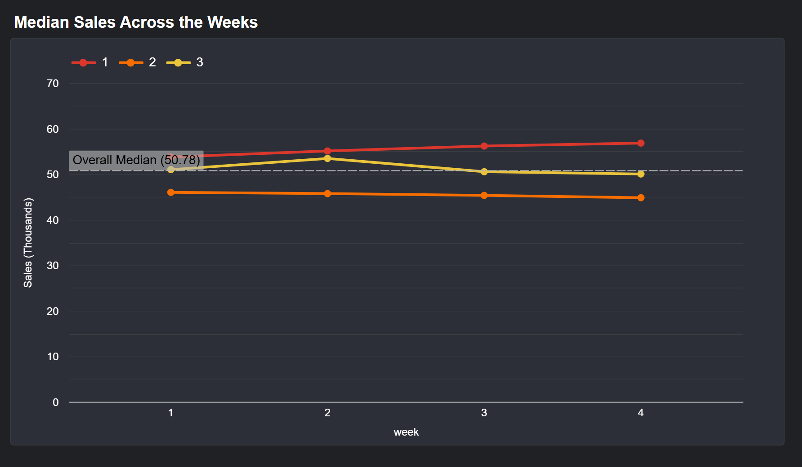

# 🅰️🅱️ A/B Testing - Cookie Cats Player Retention & Fast Food Campaign Sales

This repository contains statistical testing centered on A/B / Multivariate test results, as well as analysis and visualizations on two datasets:
1. Cookie Cats Mobile Game
2. Fast Food Marketing

Each dataset analysis will have their individual notebooks for reading.

## 🎯 **Objectives:**
| Dataset | Question/Goal |
|----------|----------------|
| [Notebook 1](https://github.com/TuringCollegeSubmissions/cgarci-DS.v3.2.2.5/blob/main/mobile-game.ipynb) - Cookie Cats | For the mobile game, compare  checkpoint placement Gate 30 vs. Gate 40. Which has a higher retention rate for players? |
| [Notebook 2](https://github.com/TuringCollegeSubmissions/cgarci-DS.v3.2.2.5/blob/main/fast-food.ipynb) - Fast Food Marketing | Between 3 types of marketing promotions, which promotion sees higher sales of the new product? |

## 🔑 Key Findings:
| Topic | Finding |
|-------|------------|
| Cookie Cats Retention | Recommended for the development team to keep the first checkpoint at **Gate 30** (Control Group). |
| Fast Food Promotions | **Promotion 1** sees the highest median sales among the three promotions. |


## 📊 Introductory Report (Looker Studio)
The 2nd dataset on Fast Food Marketing can be accompanied by an introductory [Looker Studio Report](https://lookerstudio.google.com/s/pzXi02x76aM) on the data.

It reports **data counts** and **Sales across the weeks**; providing a quick view of what we can expect to work with for the analysis:







## 📦 Libraries used:
* pandas
* numpy
* matplotlib
* seaborn
* plotly
* scipy.stats (chisquare, kruskal)
* scikit-posthocs 

### 🗃️ Original Datasets from Kaggle
1. [Mobile Games A/B Testing - Cookie Cats](https://www.kaggle.com/datasets/mursideyarkin/mobile-games-ab-testing-cookie-cats)
2. [Fast Food Marketing Campaign A\B Test](https://www.kaggle.com/datasets/chebotinaa/fast-food-marketing-campaign-ab-test)

### 🔎 Viewing / Installation:
* *Viewing Option:* Simply view the notebook files "mobile-game.ipynb" or "fast-food.ipynb"
* *Full Installation Option:* To develop on the notebooks firsthand, clone this repo\
    ```git clone https://github.com/TuringCollegeSubmissions/cgarci-DS.v3.2.2.5.git```

## 📠 Author and Contact Information
Developed by: Christine Angela Garcia | cgarci

Have further questions? You may reach out to me on the Turing College Discord


*(DS.v3.2.2.5)*\
*Developed in line with Module 2, Sprint 2, Project 2 specifications of Turing College's Data Science course*